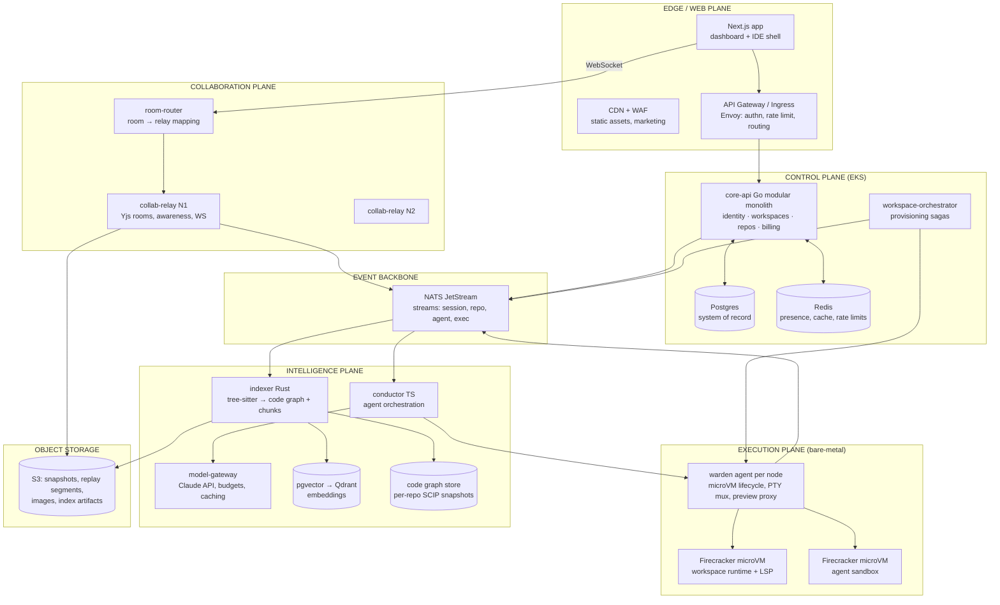

# 01 — Product Vision & System Overview

---

## Part A — Product Vision (Blueprint §1)

### A.1 Vision statement

**Atelier is a shared workshop for humans and AI agents.** Today's tools bolt AI onto a
single-player editor (Cursor, Windsurf) or bolt an editor onto a single-player AI (Bolt,
Lovable). Atelier's bet is that the durable unit of software work in the late 2020s is a
**live, multiplayer, replayable workspace** in which:

- multiple humans edit, debug, and run code together in real time,
- multiple autonomous agents operate *inside the same workspace* — visible cursors, visible
  terminals, visible diffs — not in a detached chat sidebar,
- every action (human or agent) lands on one event-sourced timeline you can scrub, replay,
  audit, and branch,
- the platform maintains a continuously updated semantic model of the repository (AST, symbol
  graph, dependency graph, embeddings) that both humans and agents query through the same API.

The tagline for the demo: *"Watch an agent's cursor move through your codebase while your
teammate reviews its diff in the same buffer — then scrub back 20 minutes to see exactly why
it made that change."*

### A.2 Why this matters in 2026

1. **Agents crossed the reliability threshold for scoped tasks** (bug fixes, test writing,
   refactors) but organizations lack the *supervision surface*: where do you watch an agent
   work, interrupt it, and audit it? An IDE-shaped multiplayer surface is that answer.
2. **Cloud development environments went mainstream** (Codespaces, DevPod, CDE mandates at
   large enterprises for supply-chain and data-loss reasons). The container-per-workspace
   pattern is now table stakes; the differentiation moved up-stack to intelligence and collab.
3. **Provenance and audit are becoming compliance requirements.** "Which agent, with which
   prompt, produced this diff, and who approved it?" is a question SOC2/EU-AI-Act-era
   customers ask. Event-sourced timelines answer it structurally.
4. **The context problem is the bottleneck**, not model quality. Repo-scale retrieval (graph +
   vector + lexical) with token-budgeted context compilation is where product quality is won.

### A.3 Engineering skills the project demonstrates

| Domain | Demonstrated by |
|---|---|
| Distributed systems | CRDT replication, single-homed room sharding, sagas, exactly-once-ish event processing, HLC-ordered logs |
| Systems programming | Rust tree-sitter indexer, Go relay with custom WS protocol, Firecracker orchestration, cgroup/netns isolation |
| Applied AI engineering | Multi-agent orchestration, deterministic replay of LLM runs, context compilation under token budgets, eval pipelines |
| Data engineering | Event sourcing, log compaction, columnar analytics offload, incremental Merkle-diffed indexing |
| Security engineering | MicroVM sandboxing, egress control, prompt-injection containment, zero-trust service identity |
| Frontend at scale | Monaco integration with CRDT bindings, virtualized IDE surfaces, offline-first sync, plugin architecture |
| Platform/SRE | OTel end-to-end tracing (including LLM spans), SLO design, chaos drills, multi-plane autoscaling |

### A.4 Differentiation vs. the field

| Product | What it is | What Atelier does differently |
|---|---|---|
| **Cursor** | Single-player desktop VS Code fork with excellent inline AI | Atelier is multiplayer-native and cloud-executed; agents are *participants with presence*, not a sidebar; full session replay; server-side repo intelligence shared by all collaborators and agents |
| **Windsurf** | Single-player desktop editor with agentic "Cascade" flows | Same axis as Cursor: no multiplayer, no shared execution plane, no event-sourced audit trail; Atelier's agent runs are deterministic and replayable |
| **Replit** | Cloud IDE + hosting with AI agent, consumer-leaning | Atelier targets team workflows: real CRDT multi-editor concurrency, per-org isolation guarantees (microVM, egress policy), repo intelligence graph, reviewable/approvable agent diffs rather than agent-owns-the-app |
| **GitHub Codespaces** | Managed devcontainers, VS Code in browser | Codespaces is infrastructure without intelligence: no native multiplayer CRDT editing, no agent orchestration, no semantic index service. Atelier treats the CDE as the *bottom* layer |
| **Lovable / Bolt** | Prompt-to-app generators for non-engineers | Opposite end: they hide the code. Atelier is for professional engineers — the code, terminal, and agent reasoning are maximally visible and auditable |

### A.5 Primary technical differentiators

1. **Agents with presence** — agents join collab rooms via the same Yjs awareness protocol as
   humans: named cursors, live typing, their own terminal panes. Interruptible mid-edit.
2. **Replayable development timeline** — one HLC-ordered event log per session unifying CRDT
   updates, terminal output, execution events, and agent reasoning traces. Scrub, branch, audit.
3. **Repository intelligence as a service** — a queryable code graph (defs/refs/calls/imports)
   plus hybrid retrieval, exposed over gRPC to the IDE, the agents, and (later) third parties.
4. **Deterministic agent runs** — every model call and tool call is recorded with hashed
   inputs; a run can be re-simulated step-for-step from its trace without re-calling models.
5. **Two-plane execution security** — control plane on Kubernetes; untrusted code in
   Firecracker microVMs on a separate plane with default-deny egress. Agent code execution and
   user code execution share one hardened sandbox story.

### A.6 Core architectural philosophy

- **The log is the product.** Collaboration, replay, audit, and agent traceability all reduce
  to "append immutable events; derive state." Design storage first, features second.
- **Planes, not tiers.** Web, collab, control, execution, and intelligence planes scale and
  fail independently. A stampede of agent jobs must never degrade human typing latency.
- **Single-writer where it's cheap, CRDT where it's necessary.** Text buffers are CRDT;
  terminals are server-authoritative streams; metadata is Postgres rows. Don't pay CRDT
  complexity for data that has a natural owner.
- **Determinism as a debugging strategy.** Anything an agent does must be reconstructible from
  its trace. Non-determinism is quarantined at the model-call boundary and recorded there.
- **Boring core, sharp edges.** Postgres, Redis, NATS, S3, Go — boring and operable. Novelty
  budget is spent only where it differentiates: the relay, the warden, the indexer, conductor.

### A.7 Long-term extensibility vision

- **Language servers as workspace services** — LSP servers run inside the workspace microVM;
  the protocol already flows over the terminal/exec channel, so adding a language = adding an
  image layer.
- **Plugin surface** (doc 03 §9): panels, commands, and agent tools as sandboxed plugins with
  a capability-scoped API — the path to an ecosystem.
- **Bring-your-own-model** — conductor's model gateway abstracts providers; enterprises can
  point at Bedrock/self-hosted endpoints per-org.
- **Timeline as an open format** — publish the replay segment format; third parties build
  analytics/coaching/compliance tools on it.
- **Beyond code** — the CRDT room + timeline + agent architecture generalizes to notebooks,
  infra runbooks, and incident response ("multiplayer terminals with replay" is a product).

---

## Part B — System Overview (Blueprint §2)

### B.1 High-level architecture



### B.2 Component interaction map

| Component | Talks to | Protocol | Purpose |
|---|---|---|---|
| IDE shell | api-gateway | HTTPS/JSON+RSC | auth, CRUD, queries |
| IDE shell | collab-relay | WebSocket (binary, custom framing) | CRDT sync, awareness, terminal, exec streams |
| collab-relay | NATS | NATS proto | publish session events; subscribe cross-service fanout |
| collab-relay | S3 | HTTPS | snapshot write/read |
| core-api | Postgres/Redis | wire/RESP | state, cache, presence directory |
| workspace-orchestrator | warden | gRPC (mTLS) | CreateVM, Snapshot, Hibernate, Exec |
| warden | microVM | vsock (Firecracker) / containerd shim | guest agent control: PTY, FS events, exec |
| indexer | NATS | consumer `repo.>` | incremental indexing triggers |
| indexer | Qdrant/pgvector, S3 | gRPC/HTTP | write chunks, graph artifacts |
| conductor | NATS | consumer/producer `agent.>` | task lifecycle events |
| conductor | model-gateway | gRPC | model calls with budget headers |
| conductor | intelligence API | gRPC | retrieval: hybrid search, graph queries |
| conductor | warden | gRPC via orchestrator | sandboxed tool execution |
| everything | OTel collector | OTLP | traces, metrics, logs |

### B.3 Core data flows

**Flow 1 — Human keystroke (hot path, budget ≤ 120 ms echo to peers):**

```
Monaco edit → y-monaco binding → Yjs doc update (local, <1ms, optimistic)
  → WS frame (batched ≤30ms) → collab-relay room
    → apply to server-side Y.Doc → broadcast to room peers
    → append to JetStream SESSION stream (async, off hot path)
      → replay compactor (S3 segments)         [timeline]
      → indexer dirty-set marker (debounced)   [intelligence]
```

**Flow 2 — Terminal I/O:**

```
xterm.js input → WS frame (channel=pty, seq) → relay → NATS exec.stdin.{wsId}
  → warden → vsock → guest PTY
guest PTY output → warden (coalesce 8–16ms) → NATS exec.stdout.{wsId}
  → relay → all room subscribers (humans + agent observers)
  → JetStream SESSION stream (for replay)
```

**Flow 3 — Agent task ("fix this failing test"):**

```
User creates task (chat panel or PR comment) → core-api → agent.task.created
  → conductor: Planner step → task graph persisted (event-sourced)
  → Coder steps: retrieval via intelligence API → model call via gateway
     → structured patch tool → patch applied as CRDT ops via relay (agent has presence)
  → Tester step: exec in agent sandbox microVM → results as events
  → Reviewer step → verification gates → approval request event
  → human approves in IDE → conductor finalizes → git commit in workspace
Every step emits agent.step.* events → timeline + AI trace store
```

### B.4 Request lifecycle walkthroughs

**Lifecycle 1 — Opening a workspace (cold):**

1. `GET /w/{workspaceId}` → Next.js server component: authz check against core-api, streams
   IDE shell with workspace manifest (file tree head, room token, warden hint) inlined.
2. Client opens WS to room-router with a short-lived signed **room token** (JWT: userId,
   workspaceId, role, expiry ≤ 60s). Router consults Redis room directory: room unmapped →
   rendezvous-hash onto a relay node, record mapping, return relay address.
3. Client connects to relay; Yjs sync protocol runs (SyncStep1: client state vector →
   SyncStep2: server diff → client applies). Relay had loaded doc from latest S3 snapshot +
   JetStream tail on first join.
4. In parallel, core-api emits `workspace.open.requested`; orchestrator checks VM state:
   hibernated → warden restores Firecracker snapshot (target ≤ 2s) or cold-boots from rootfs
   (target ≤ 8s). Readiness event flows back over NATS → relay → client status bar.
5. LSP servers boot inside the guest; language features attach. Editor was already interactive
   from step 3 — execution readiness is progressive, never blocking typing.

**Lifecycle 2 — Semantic search ("where is auth token validated?"):**

1. IDE → `POST /api/intelligence/search` → intelligence API.
2. Parallel: lexical (Tantivy BM25 over trigram-tokenized code), vector (query embedding →
   ANN top-50), graph expansion (seed symbols → 1-hop callers/callees).
3. Reciprocal-rank-fusion merge → cross-encoder rerank top-30 → top-10 with byte-span
   anchors → IDE renders peek view. Budget: p50 ≤ 300 ms, p95 ≤ 800 ms warm.

**Lifecycle 3 — Workspace provisioning saga:** see doc 09 §5 for the full saga with
compensation steps (register → allocate volume → schedule VM → mount → clone → index → ready;
each step idempotent, each with compensating action).

### B.5 Event flow architecture

All cross-service communication that is not a synchronous query flows through **NATS
JetStream** streams (full subject taxonomy and retention in doc 09 §3):

| Stream | Subjects | Producers → Consumers | Retention |
|---|---|---|---|
| `SESSION` | `session.{id}.crdt/pty/exec/presence` | relay, warden → compactor, indexer-trigger | 48h interest, then S3 |
| `REPO` | `repo.{id}.changed/indexed/pushed` | relay, core-api → indexer, conductor | 7d work-queue |
| `AGENT` | `agent.task.*`, `agent.step.*`, `agent.approval.*` | core-api, conductor → conductor, timeline, notifier | 30d |
| `EXEC` | `exec.{wsId}.lifecycle/stdout/stdin` | warden → relay, timeline | 24h |
| `SYS` | `sys.audit.*`, `sys.billing.*` | all → audit-sink, metering | 90d → S3 forever |

Ordering: per-subject ordering from NATS suffices within a channel; cross-channel ordering for
replay uses **hybrid logical clocks** stamped at the producing service (doc 12 §2).

### B.6 Repository indexing flow (summary; full detail doc 06)

```
git clone/push OR debounced CRDT save
  → repo.{id}.changed {merkleRoot, dirtyPaths[]}
  → indexer: parse dirty files (tree-sitter) → symbols/refs diff → graph patch
  → chunker: AST-aware chunks for changed spans → embed (batched) → upsert vectors
  → publish repo.{id}.indexed {version} → conductor & IDE invalidate retrieval caches
Full pass: Merkle-tree comparison makes "index the repo" and "index this keystroke's
fallout" the same code path at different dirty-set sizes.
```

### B.7 Autonomous agent execution flow (summary; full detail doc 07)

Conductor is an **event-sourced state machine**, not a long-running process holding state in
memory. A task run is a DAG of steps; each step = (context compilation → model call(s) → tool
call(s) → verification) with every input/output recorded. Crash recovery = replay events.
Human approval gates are just steps that wait on an `agent.approval.granted` event.
