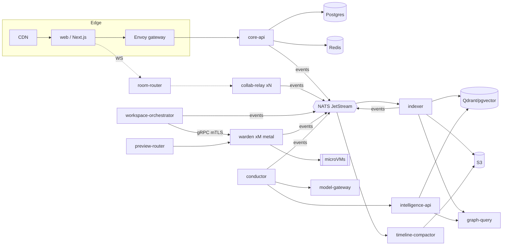
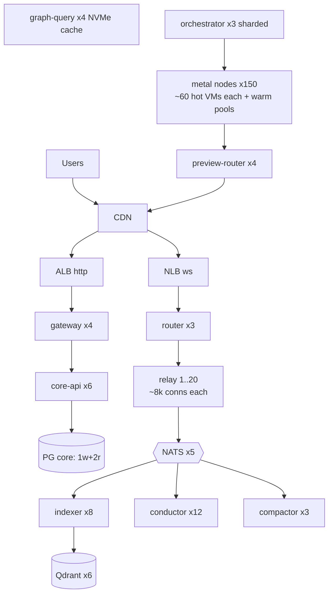

# 15 — Final Deliverables: Concrete Artifacts (Blueprint §20)

DB schemas live in doc 08; warden/event protobufs in doc 09 §6. This doc holds the remaining
concrete artifacts: trees, protocols, manifests, workflows, topology.

---

## 1. Monorepo structure

```
atelier/
├── turbo.json  pnpm-workspace.yaml  go.work  Cargo.toml(workspace)
├── proto/                          # single source of truth for contracts
│   ├── buf.yaml  buf.gen.yaml
│   └── atelier/{events,exec,collab,intel,agent}/v1/*.proto
├── apps/
│   └── web/                        # doc 03 §1 tree
├── services/
│   ├── core-api/                   # Go modular monolith
│   │   ├── cmd/core-api/main.go
│   │   └── internal/{identity,workspace,repo,billing,approval}/   # boundary-enforced
│   ├── collab-relay/               # Go: internal/{room,wsproto,persist,awareness}
│   ├── room-router/                # Go
│   ├── workspace-orchestrator/     # Go: internal/{saga,placement,fleet}
│   ├── warden/                     # Go: internal/{vm,jailer,ptymux,preview,reconcile}
│   ├── guest-agent/                # Go: internal/{pty,exec,docfs,watch,lsp}
│   ├── indexer/                    # Rust: crates/{parse,graph,chunk,merkle,artifact}
│   ├── graph-query/                # Rust
│   ├── intelligence-api/           # TS: src/{retrieval,fusion,rerank,contextpack}
│   ├── conductor/                  # TS: src/{fold,worker,agents/*,gates,budget,tools}
│   ├── model-gateway/              # TS: src/{providers,budget,cache,redact}
│   └── timeline-compactor/         # Go
├── packages/                       # shared TS
│   ├── protocol/                   # WS frame codecs (client+relay fixtures)
│   ├── gen/                        # buf-generated ts
│   ├── ui/  config/
├── infra/
│   ├── terraform/{modules,envs/{dev,staging,prod}}/
│   ├── k8s/{base,overlays}/        # kustomize, Argo app-of-apps
│   └── images/                     # BuildKit bake: base rootfs images, service images
├── fixtures/                       # eval repos + golden tasks + injection suite
├── docs/                           # this document set
└── .github/workflows/
```

## 2. Service map (runtime view)



## 3. WebSocket protocol (client ↔ relay)

Binary frame: `[u8 channel][u8 flags][u16 streamId][varint length][payload]`

| Channel | Payload | Direction |
|---|---|---|
| 0x01 CTRL | protobuf: HELLO{roomToken}, WELCOME{roomEpoch, resumeInfo}, PING/PONG{rttProbe}, RECONNECT{newRelay}, ERROR{code} | both |
| 0x02 CRDT | Yjs sync protocol bytes (SyncStep1/2/Update), streamId = subdoc | both |
| 0x03 AWARE | y-protocols awareness delta | both |
| 0x04 PTY | `[u64 seq][bytes]` out / `[u64 clientSeq][bytes]` in; streamId = terminal | both |
| 0x05 EXEC | protobuf run lifecycle/log frames | server→client (+cancel c→s) |
| 0x06 LSP | LSP JSON-RPC (length-prefixed), streamId = language server | both |
| 0x07 AGENT | protobuf agent run events (panel stream) | server→client |
| 0x08 FS | file tree deltas | server→client |

Flags: `0x1 compressed(zstd)`, `0x2 batch`, `0x4 carries-traceparent`. Handshake: WSS +
`HELLO` within 5 s or drop; resume: `HELLO{resumeToken}` → relay replays pty gaps from ring
buffers and runs CRDT re-sync (no app-level replay needed).

## 4. API surface (Connect/JSON at the edge — representative)

```
POST /v1/orgs/{org}/workspaces               create (env spec)          → 202 + saga id
GET  /v1/workspaces/{id}                     state incl. lifecycle
POST /v1/workspaces/{id}/open                mint room token + warm hint
POST /v1/workspaces/{id}/hibernate | fork    lifecycle verbs
POST /v1/repos/{id}/search                   hybrid search {q, filters} → spans + why[]
GET  /v1/repos/{id}/graph/symbol/{fq}        defs/refs/callers?depth=
POST /v1/agent/runs                          {goal, scope, budget, policy} → run id
GET  /v1/agent/runs/{id}/events?after=seq    poll fallback (WS is primary)
POST /v1/agent/runs/{id}/approvals/{stepId}  {decision, hunks[]}
GET  /v1/sessions/{id}/replay/manifest       segment manifest (authz'd, signed URLs)
```

Errors: RFC 9457 problem+json; idempotency: `Idempotency-Key` honored on all POSTs.

## 5. Kubernetes manifests (representative: collab-relay)

```yaml
apiVersion: apps/v1
kind: Deployment
metadata: { name: collab-relay, namespace: collab }
spec:
  replicas: 3
  strategy: { type: RollingUpdate, rollingUpdate: { maxUnavailable: 0, maxSurge: 1 } }
  template:
    metadata:
      labels: { app: collab-relay }
      annotations: { linkerd.io/inject: enabled }
    spec:
      terminationGracePeriodSeconds: 600        # drain rooms, don't kill them
      containers:
        - name: relay
          image: ghcr.io/atelier/collab-relay@sha256:…   # digest-pinned, cosign-verified
          ports: [{ name: ws, containerPort: 8443 }, { name: metrics, containerPort: 9090 }]
          resources:
            requests: { cpu: "2", memory: 4Gi }
            limits:   { memory: 6Gi }           # no CPU limit: latency > fairness here
          readinessProbe: { httpGet: { path: /readyz, port: 9090 } }
          lifecycle:
            preStop:                             # begin drain: deregister + room handoff
              httpGet: { path: /internal/drain, port: 9090 }
          env:
            - { name: NATS_URL, valueFrom: { secretKeyRef: { name: nats-creds, key: url } } }
      securityContext: { runAsNonRoot: true, seccompProfile: { type: RuntimeDefault } }
---
apiVersion: autoscaling/v2
kind: HorizontalPodAutoscaler
metadata: { name: collab-relay }
spec:
  scaleTargetRef: { apiVersion: apps/v1, kind: Deployment, name: collab-relay }
  minReplicas: 3
  maxReplicas: 40
  metrics:
    - type: Pods
      pods:
        metric: { name: relay_active_connections }     # custom metric via adapter
        target: { type: AverageValue, averageValue: "8000" }
  behavior:
    scaleDown: { stabilizationWindowSeconds: 1800 }    # rooms are sticky; scale down slowly
---
apiVersion: cilium.io/v2
kind: CiliumNetworkPolicy                              # default-deny is namespace-wide;
metadata: { name: relay-egress }                       # this is the explicit allow
spec:
  endpointSelector: { matchLabels: { app: collab-relay } }
  egress:
    - toEndpoints: [{ matchLabels: { app: nats } }]
    - toFQDNs: [{ matchPattern: "*.s3.*.amazonaws.com" }]
    - toEndpoints: [{ matchLabels: { app: redis } }]
```

## 6. Docker/image architecture

- **Service images:** distroless multi-stage (Go: static scratch; Rust: distroless-cc; TS:
  node-slim → pruned prod deps), digest-pinned, cosign-signed, SBOM attached.
- **Workspace rootfs images:** `base` (init, guest-agent, git, common tools) → per-stack
  layers (`node20`, `py312`, `go122`) → org custom layers (devcontainer-spec build, cached);
  exported as eStargz for lazy pull; content-addressed store on node NVMe.
- BuildKit bake file defines the whole matrix; CI builds only affected targets (turbo hash).

## 7. GitHub Actions (representative: ci.yml skeleton)

```yaml
name: ci
on: { pull_request: {} }
concurrency: { group: ci-${{ github.ref }}, cancel-in-progress: true }
jobs:
  detect:
    runs-on: ubuntu-latest
    outputs: { filters: ${{ steps.turbo.outputs.affected }} }
    steps: [ …checkout depth 0…, id: turbo — `turbo run build --dry=json --filter=...[origin/main]` ]
  proto:
    steps: [ buf lint, buf breaking --against 'origin/main' ]
  ts:   { needs: detect, steps: [ pnpm i --frozen-lockfile, turbo run lint typecheck test build --filter=affected, size-limit ] }
  go:   { needs: detect, steps: [ golangci-lint, go test -race ./... (affected modules), go build ] }
  rust: { needs: detect, steps: [ cargo clippy -D warnings, cargo nextest run (affected crates) ] }
  crdt-props: { steps: [ property suite: convergence under random interleavings, 5-min budget ] }
  agent-eval:
    if: contains(github.event.pull_request.labels.*.name, 'ai-surface') ||
        (affected includes conductor|prompts|intelligence)
    steps: [ run golden suite vs baseline, comment pass-rate + cost delta, fail on significant regression ]
```

## 8. Terraform layout

```
infra/terraform/
├── modules/
│   ├── network/          # VPC, subnets (control/collab/exec/data tiers), NAT, endpoints
│   ├── eks/              # cluster, karpenter pools (general, collab-latency, intel-compute)
│   ├── exec-plane/       # metal ASGs, warden bootstrap (SSM), NVMe raid, egress-proxy
│   ├── data/             # aurora-pg (core/intel/timeline), elasticache, s3 (+lifecycle), nats (EC2 or Synadia)
│   ├── observability/    # mimir/loki/tempo (S3-backed), grafana, collectors
│   └── security/         # SPIRE, KMS keys (per-tenant grants), secrets-manager, WAF
└── envs/{dev,staging,prod}/   # terragrunt: module composition + sizing per env
```

## 9. Scaling topology (Stage-3, one region)



Deployment architecture per environment, canary mechanics, and rollback paths: doc 13 §3.

---

## Where to start (first 10 concrete tasks)

1. Scaffold monorepo (turbo + pnpm + go.work + cargo workspace + buf).
2. `proto/` v1: EventEnvelope, Warden, WS CTRL messages; codegen wired for all 3 languages.
3. `collab-relay` v0: rooms, y-protocol sync, awareness, in-memory only + the multiplayer
   Playwright harness (test rig *before* persistence).
4. `apps/web` IDE shell: kernel, connection layer, Monaco + y-monaco, presence rendering.
5. JetStream + snapshotter + S3: persistence with kill-the-relay recovery test.
6. Workspace pod (gVisor) + guest-agent PTY + terminal channel end-to-end.
7. doc-fs sync + git clone flow (the MVP exit demo now works).
8. core-api: identity/orgs/workspaces + outbox + room tokens.
9. OTel end-to-end + the keystroke-latency RUM metric + first Grafana board.
10. Indexer v0: tree-sitter parse → symbols → Postgres graph → search endpoint → IDE search UI.
```
